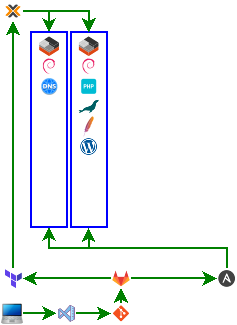

## Description
**Deploy inside Debian instances on Proxmox with Ansible using Builtin funtion**

## Goal

## Autor
* [Erki Polo Manresa](https://linkedin.com/in/erkipolo)

## To see how get to the solution
* [Youtube link coming soon](Próximamente)

## Requirements
- Proxmox installed
- Debian containers instances
- SSH Public Key inside the Debian containers instances
- Access to Debian repository
